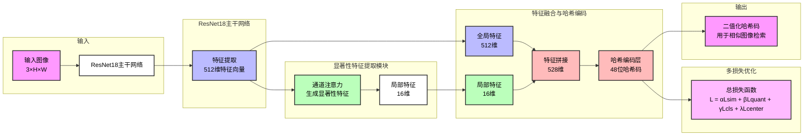

## 模型架构说明

该模型架构图展示了基于ResNet18的深度哈希图像检索模型的关键结构，主要包含以下核心组件及其输入输出维度：

1. **输入层**：
   - 输入：3通道图像 (3×H×W)

2. **ResNet18主干网络**：
   - 输入：3×H×W
   - 输出：512维特征向量

3. **显著性特征提取模块**：
   - 输入：512维特征向量
   - 输出：16维局部特征

4. **特征融合与哈希编码**：
   - 输入1：全局特征（来自ResNet18，512维）
   - 输入2：局部特征（来自显著性特征提取模块，16维）
   - 融合：将两种特征拼接得到528维特征向量
   - 输出：48位哈希码

5. **多损失优化**：
   - 总损失函数：L = αLsim + βLquant + γLcls + λLcenter
   - 其中：Lsim为哈希相似度损失，Lquant为量化损失，Lcls为分类损失，Lcenter为中心损失

6. **输出层**：
   - 二值化哈希码：用于相似图像检索，通过计算汉明距离实现快速检索 