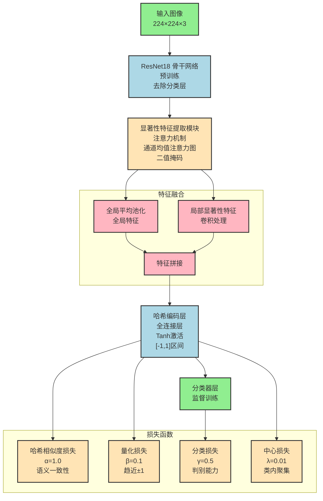

# SFDH-FGIR 网络架构图

## 网络架构说明

### 1. 网络整体架构
本研究提出的哈希检索网络基于 ResNet18 深度卷积神经网络，针对图像检索任务引入显著性特征提取模块、哈希学习机制与辅助损失函数进行联合优化。网络主要由四部分组成：
- 骨干提取器（ResNet18）
- 显著性特征提取模块
- 哈希编码模块
- 分类器模块

### 2. 骨干网络
- 采用预训练的 ResNet18 网络
- 去除原始全连接分类层
- 仅保留卷积特征部分
- 用于提取输入图像的深层语义特征
- 颜色编码：浅蓝色

### 3. 显著性特征提取模块
- 基于注意力机制
- 计算特征图通道均值生成注意力图
- 基于预设阈值生成二值掩码
- 实现对缺陷区域的精确关注
- 颜色编码：浅黄色

### 4. 特征融合模块
- 全局特征：通过全局平均池化获得
- 局部特征：显著性区域特征经卷积处理
- 特征拼接：融合全局和局部特征
- 颜色编码：浅粉色

### 5. 哈希编码层
- 全连接层映射为低维哈希向量
- 使用 Tanh 激活函数
- 输出限制在 [-1, 1] 区间
- 便于后续二值化处理
- 颜色编码：浅蓝色

### 6. 分类器层
- 对哈希向量进行分类监督训练
- 颜色编码：浅绿色

### 7. 损失函数设计
为了增强哈希表示的语义一致性、可二值化能力与类内聚集性，网络采用多损失联合优化策略：

1. **哈希相似度损失**（α=1.0）
   - 保持哈希码之间与标签语义的一致性
   - 确保检索结果的语义准确性

2. **量化损失**（β=0.1）
   - 促使哈希向量趋近于 ±1
   - 便于后续二值化处理

3. **分类损失**（γ=0.5）
   - 提升哈希码的判别能力
   - 增强语义表达

4. **中心损失**（λ=0.01）
   - 增强同类样本在哈希空间中的聚合性
   - 提升检索精度

通过动态权重参数自适应调整各损失项的重要性，实现多目标优化，在保证语义表达的同时，有效提升了哈希表示的可分性和稳定性，从而显著改善图像检索的整体性能。 